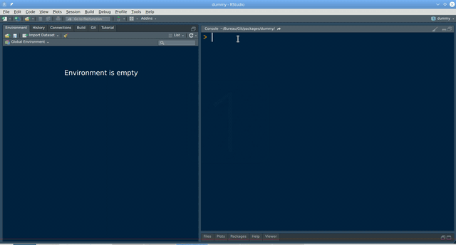

# docsifier

<!-- badges: start -->
[](https://codecov.io/github/etiennebacher/docsifier)
[](https://github.com/etiennebacher/docsifier/actions)
<!-- badges: end -->

The goal of `{docsifier}` is to generate the structure to use [docsify.js](https://docsify.js.org/#/) for the documentation of an R
package.

## Installation and documentation

You can install the development version with:

``` r
# install.packages("devtools")
devtools::install_github("etiennebacher/docsifier")
```
Follow the demo below to see how to implement `{docsifier}` in your package, and check the [documentation](https://docsifier.etiennebacher.com) for more details.


## Demo

Here's a small demo that you can also find [here](https://docsifier.etiennebacher.com/#/demo). 

Let’s see the steps to create your documentation with `{docsifier}`. First, let’s create a dummy package:

``` r
devtools::create("dummy")
```

This has the following structure:

    .
    ├── DESCRIPTION
    ├── NAMESPACE
    ├── R
    │   └── hello.R
    ├── dummy.Rproj
    └── man
        └── hello.Rd

You can do your development workflow as usual. In fact, you can add the documentation whenever you want. For now, we just create the documentation.

```r
library(docsifier)
use_docsify()

✓ Folder "docs" has been created.
● Folder "docs" is not standard in R packages. Don't forget to add it in .buildignore.
✓ File "index.html" has been created.
✓ Files "homepage.md", "_sidebar.md", and "howto.md" have been created.
```

```
.
├── DESCRIPTION
├── NAMESPACE
├── R
│   └── hello.R
├── docs
│   ├── _sidebar.md
│   ├── homepage.md
│   ├── howto.md
│   └── index.html
├── dummy.Rproj
└── man
    └── hello.Rd
```

We can see that the folder "docs" and the template files were created. If you already had a folder "docs", the files would have been created inside. You can already run `preview_docsify()` to see what the documentation looks like. 

The structure of the documentation is made in `_sidebar.md` and the options detailed in the part "Customize" are in `index.html`. You can now add `.md` or `.Rmd` files in "docs" with `add_md()` and `add_rmd()`. If you want to customize the style of the documentation, you can add a CSS file with `add_css()` or check the themes available [online](https://docsify.js.org/#/themes).

When you have finished your documentation, you can deploy it with several tools. This procedure is detailed in the ["Deploy" part](https://docsifier.etiennebacher.com/#/deploy) in the documentation. 

Here's a GIF that reproduces these steps (except the package creation and the online deployment):



## Code of Conduct

Please note that the docsifier project is released with a [Contributor Code of Conduct](https://contributor-covenant.org/version/2/0/CODE_OF_CONDUCT.html). By contributing to this project, you agree to abide by its terms.
